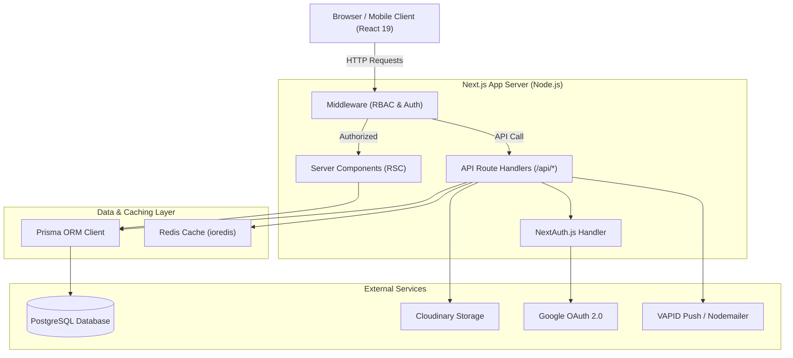
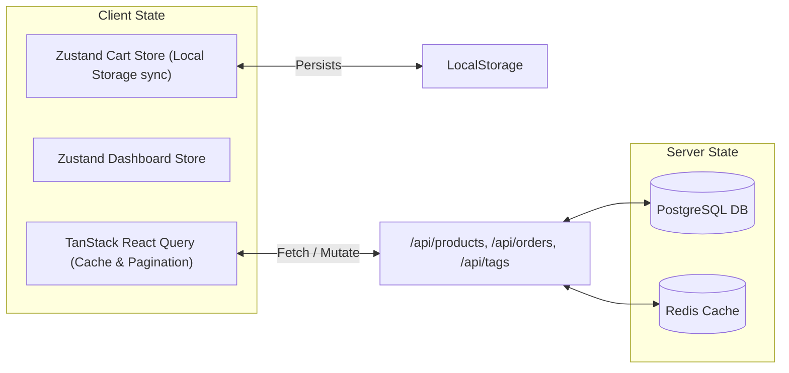

# System Architecture

## Overview

CandyEco (`candy_client`) is a modern, responsive e-commerce platform and Content Management System (CMS) designed for high performance, accessibility, and smooth user experiences across mobile and desktop interfaces. Built on Next.js 16 (App Router) and React 19, the architecture leverages Server Components, edge-compatible API routes, real-time caching, and robust database models.

---

## Tech Stack

| Layer | Technology | Purpose |
|---|---|---|
| **Frontend Framework** | Next.js 16 (App Router), React 19 | Server & Client Components, routing, SSR/ISR |
| **Language** | TypeScript 5.8 | Type safety across frontend and backend |
| **Styling** | Tailwind CSS 3.4 | Utility-first responsive styling & animations |
| **State Management** | Zustand 5.0 | Client-side transient state (Cart, Dashboard) |
| **Data Fetching** | TanStack React Query 5.101 | Server state caching, optimistic updates |
| **Backend & APIs** | Next.js API Routes (Route Handlers) | RESTful API endpoints, server-side actions |
| **Database ORM** | Prisma ORM 7.8 | Database client, schema management, migrations |
| **Database Engine** | PostgreSQL 14+ | Relational data store |
| **In-Memory Cache** | Redis (`ioredis` 5.11) | Presence tracking, rate-limiting, session cache |
| **Authentication** | NextAuth.js 4.24 (`@next-auth/prisma-adapter`) | Google OAuth 2.0 & Credentials (phone/password) |
| **Media Storage** | Cloudinary | Upload, storage, and optimization of media assets |
| **Notifications** | Web-Push 3.6 & Nodemailer 7.0 | Browser push notifications and email delivery |

---

## System Component Diagram

---

## Architectural Layers

### 1. Presentation Layer (`app/`, `components/`)
- **Server Components (RSC)**: Used by default for initial page loads, SEO optimization, and static rendering (e.g., Home page catalog base, Product details base).
- **Client Components (`"use client"`)**: Used for interactive sections such as `ProductBrowser.tsx`, `SearchBar.tsx`, `HeroCarousel.tsx`, `CmsSection.tsx`, and `CartStore`.
- **UI & Layouts**: Uses responsive grid systems, dynamic filters, infinite scrolling, modal forms, and notification banners.

### 2. Service & Business Logic Layer (`lib/`)
- **Authentication (`lib/auth.ts`)**: Configures NextAuth with Google OAuth & Credentials providers, handling JWT creation, database user syncing, and role promotion (`admin` vs `user`).
- **Media Upload (`lib/cloudinary.ts`)**: Encapsulates file uploads, image transformations, and Cloudinary media deletion.
- **Cache & Realtime (`lib/redis.ts`, `lib/presence.ts`)**: Connects to Redis for user presence tracking and transient cache store.
- **Tag Validation (`lib/tags.ts`)**: Automated database check (`ensureProductTags`) ensuring products remain indexed with relevant tags.
- **Notifications (`lib/push-notifications.ts`, `lib/email.ts`)**: Sends Web-Push notifications to subscribed browsers and order status emails via SMTP.

### 3. Data Access Layer (`prisma/`)
- **Prisma Client (`lib/prisma.ts`)**: Provides typed database access using single-instance connection pooling via `@prisma/adapter-pg`.
- **Database Schemas (`prisma/schema.prisma`)**: Declarative entity relationships, indexes, unique constraints, and cascades.

---

## State Management Architecture

1. **Zustand**: Manages local shopping cart (`lib/cart-store.ts`) with browser persistent storage, active dashboard UI state (`lib/dashboard-store.ts`), and presence status.
2. **TanStack React Query**: Manages asynchronous server data state (e.g., lazy loaded products, active carousel slides, tag recommendations) with automated caching, garbage collection, and optimistic UI updates.
