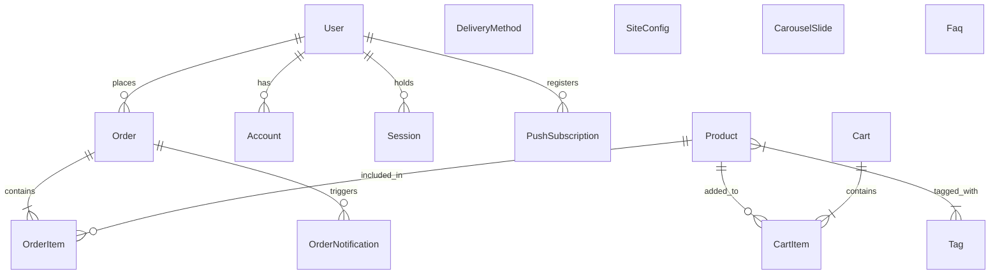

# Database Documentation & Entity Relationships

## Overview

CandyEco uses **PostgreSQL** as its primary relational database, managed via **Prisma ORM 7.8**. The schema encompasses product catalog management, tags, cart sessions, customer orders, NextAuth user authentication, site configuration, carousel management, and Web Push notifications.

---

## Entity Relationship Diagram (ERD)

---

## Model Descriptions & Field Specifications

### 1. Catalog & CMS Models

#### `Product`
Stores store items, prices, ratings, and publish status.
- `id` (UUID, Primary Key)
- `title` (String), `slug` (String, Unique)
- `price` (String, formatted price e.g. "$12.00")
- `category` (String), `imageUrl` (String), `description` (String), `story` (String)
- `limitBay` (Int, optional purchase limit per user)
- `state` (String, default "exist")
- `visibility` (Int, default 0)
- `rating` (Float, default 0.0), `ratingCount` (Int, default 0)
- `publishedAt` (DateTime, optional)
- Relations: `tags` (`Tag[]`), `cartItems` (`CartItem[]`), `orderItems` (`OrderItem[]`)

#### `Tag`
Dedicated entity model for product categorizations and filter autocomplete.
- `id` (UUID, Primary Key)
- `name` (String, Unique)
- Relations: `products` (`Product[]`)

#### `CarouselSlide`
Hero carousel slides dynamically loaded on homepage.
- `id` (UUID), `title` (String), `description` (String), `imageUrl` (String), `linkUrl` (String, optional), `order` (Int, default 0)

#### `SiteConfig` & `Faq`
- `SiteConfig`: Key-value store (`key` PK, `value` String) for dynamic app limits (e.g. `carousel_max_slides`, fidelity configurations).
- `Faq`: `id`, `question`, `answer`, timestamps.

---

### 2. E-Commerce Shopping & Orders

#### `Cart` & `CartItem`
- `Cart`: Session-linked active cart (`id` PK, `sessionId` String Unique).
- `CartItem`: Links `Cart` to `Product` with `quantity`. Unique constraint on `[cartId, productId]`.

#### `Order` & `OrderItem`
- `Order`: Checkout transactions.
  - `id` (UUID), `reference` (String Unique), `sessionId` (String optional)
  - `status` (String: "pending", "processing", "completed", "cancelled")
  - `totalPrice` (String), `totalAmount` (Float)
  - Customer Information: `customerName`, `customerPhone`, `customerEmail`, `shippingAddress`
  - `userId` (FK to `User`, optional, set to NULL on delete)
  - `deliveryMethod` (String optional)
- `OrderItem`: Snapshot of product purchases.
  - `orderId` (FK to `Order`), `productId` (FK to `Product`)
  - `quantity` (Int), `priceAtPurchase` (String), `amountAtPurchase` (Float)

---

### 3. Authentication & Users (NextAuth Schema)

- `User`: `id`, `name`, `email` (Unique), `emailVerified`, `image`, `password` (hashed), `role` (default "user"), `phone` (Unique), `address`, `status`, `trustScore`.
- `Account`: OAuth provider accounts linked to users (`provider`, `providerAccountId` Unique).
- `Session`: NextAuth active database sessions.
- `VerificationToken`: Passwordless/Email verification tokens.

---

### 4. Notifications & Logistics

- `DeliveryMethod`: Shipping methods (`id`, `name` Unique, `price`, `homePrice`, `stockPrice`, `active` Boolean).
- `OrderNotification`: Unread status alerts linked to `Order`.
- `PushSubscription`: Browser Web-Push push subscriptions (`endpoint` Unique, `p256dh`, `auth`, `userId` FK, `deviceToken` Indexed).

---

## Migration & Maintenance Commands

| Action | CLI Command |
|---|---|
| **Apply Dev Migration** | `npx prisma migrate dev` |
| **Deploy Production Migration** | `npx prisma migrate deploy` |
| **Generate Prisma Client** | `npx prisma generate` |
| **Verify & Ensure Product Tags** | `npm run db:ensure-tags` |
