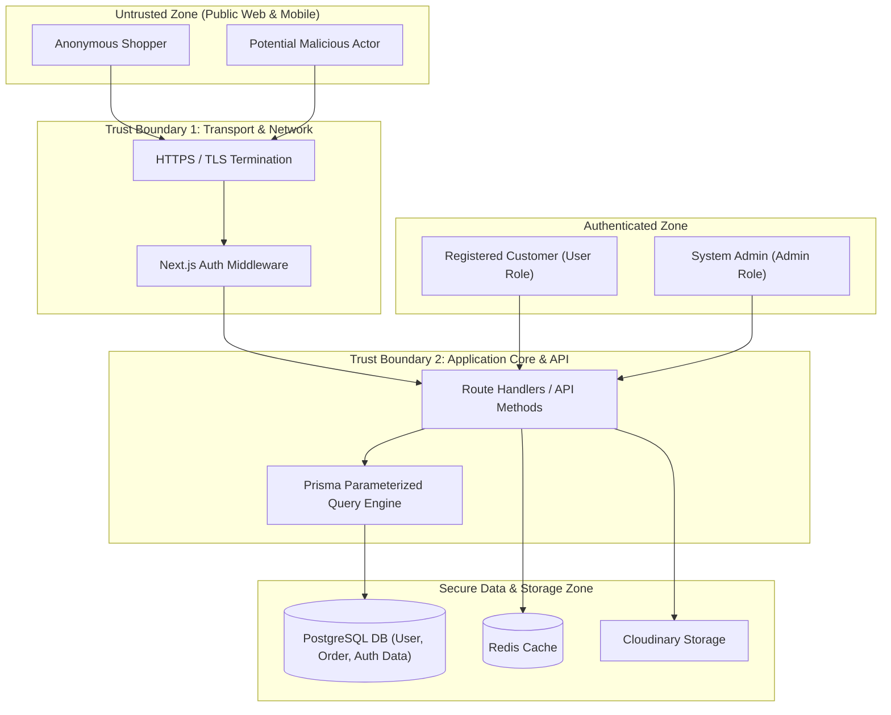

# Threat Model & STRIDE Analysis

## Overview

This document provides a comprehensive threat model for the CandyEco e-commerce and CMS platform. It applies the **STRIDE** methodology (**S**poofing, **T**ampering, **R**epudiation, **I**nformation Disclosure, **D**enial of Service, **E**levation of Privilege) to analyze threat vectors, trust boundaries, system assets, and security controls.

---

## Assets & Trust Boundaries

### High-Value Assets
1. **User Credentials & Hash Records**: Passwords, email addresses, phone numbers.
2. **Order & Customer Records**: Shipping addresses, order histories, transactions.
3. **Admin Privileges & Session Tokens**: JWTs allowing CMS mutations.
4. **Third-Party API Secrets**: Google OAuth secret, Cloudinary credentials, VAPID private keys.
5. **System Availability**: Continuous operation of shopping cart and checkout endpoints.

---

## STRIDE Threat Matrix & Countermeasures

### 1. Spoofing (Identity Deception)
- **Threat Vector**: Attacker impersonates an existing customer or admin to gain unauthorized access.
- **Risk Level**: **HIGH**
- **Mitigation Controls**:
  - NextAuth.js JWT strategy signed with high-entropy `NEXTAUTH_SECRET`.
  - Password verification via `bcryptjs` (12 rounds).
  - Google OAuth identity assertion with scope constraints.
  - Guest customer rating checks enforcing phone/email matching against order history.

---

### 2. Tampering (Unauthorized Data Modification)
- **Threat Vector**: Intercepting or modifying shopping cart item prices, product metadata, or rating scores.
- **Risk Level**: **HIGH**
- **Mitigation Controls**:
  - Cart totals and order prices are recalculated server-side using canonical DB prices during checkout. Client price inputs are never trusted.
  - Product rating updates require explicit database checks (`can-rate` route validation).
  - Parameterized database operations prevent SQL parameter tampering.

---

### 3. Repudiation (Action Denial)
- **Threat Vector**: User or admin denies performing a critical action (e.g. updating delivery prices or changing order status).
- **Risk Level**: **MEDIUM**
- **Mitigation Controls**:
  - Server logging routines (`logs/featurs.ts`) log critical authentication and order events.
  - Database timestamps (`createdAt`, `updatedAt`) on all key schema models.

---

### 4. Information Disclosure (Data Leakage)
- **Threat Vector**: Unauthenticated users viewing customer phone numbers, addresses, or internal database metadata.
- **Risk Level**: **HIGH**
- **Mitigation Controls**:
  - `middleware.ts` restricts access to `/dashboard/*` endpoints.
  - API GET routes selectively exclude sensitive fields (e.g., stripping internal ratings on public catalog loads unless requested with admin privileges).
  - Environment variables containing API keys are excluded from source control (`.gitignore`).

---

### 5. Denial of Service (DoS / Resource Exhaustion)
- **Threat Vector**: Flooding product search API or image upload endpoints to exhaust CPU/memory or exceed Cloudinary storage quotas.
- **Risk Level**: **MEDIUM**
- **Mitigation Controls**:
  - Search inputs use client-side debouncing and pagination (`limit=6`, `page=1`).
  - Read-only catalog requests bypass database write mutations.
  - Admin-only role authorization required on media upload routes (`/api/upload`).
  - Redis connection pooling with automatic client throttling.

---

### 6. Elevation of Privilege (Unauthorized Admin Access)
- **Threat Vector**: Standard user promoting their account role from `user` to `admin`.
- **Risk Level**: **CRITICAL**
- **Mitigation Controls**:
  - Admin role check in NextAuth `signIn` callback strictly compares user email against `ADMIN_EMAILS` environment variable.
  - Automatic admin promotion for initial user creation is isolated to empty database states (`userCount === 0`).
  - Server-side role checks on all mutating API endpoints (`status 403 Forbidden`).

---

## Security Audit & Verification Schedule

| Audit Area | Frequency | Standard / Tool |
|---|---|---|
| Dependency Vulnerability Scan | Weekly | `npm audit` / Dependabot |
| Static Code Security Analysis | On Commit | TypeScript strict mode + ESLint security rules |
| Secret Leak Prevention | Pre-commit | `.gitignore` inspection & Git scanning tools |
| Permission & RBAC Review | Bi-monthly | Access matrix review against `ADMIN_EMAILS` |
